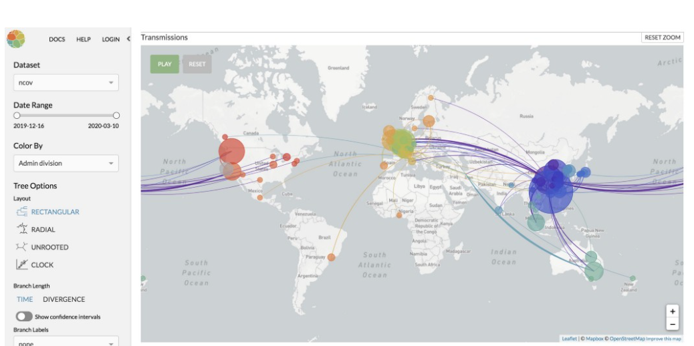

For this week's visual, I want to present the maps using mapbox visual.
I talked about mapbox visual in last week's reflection about many
of its map types it can create. This week, I found visuals created
by mapbox which focus on the topic of COVID-19. When I did my MQP, 
my teammates and I created the visual for people's moving patterns
with mapbox. The visuals I found this week, however, focus on
the virus spread trend and the health conditions. For exmaple, 
in the following picture, it not only highlights areas but also
shows the directions of virus spread from origin to destination. With this visual,
we could have a clear sense about what areas we should look at
and what exactly are happening among these areas.

It is also possible to show chronicle change on a map. If we set
the parameter to be the date, we can select each date and the map
will only display the data on that date. This is pretty fun and
powerful as well:

